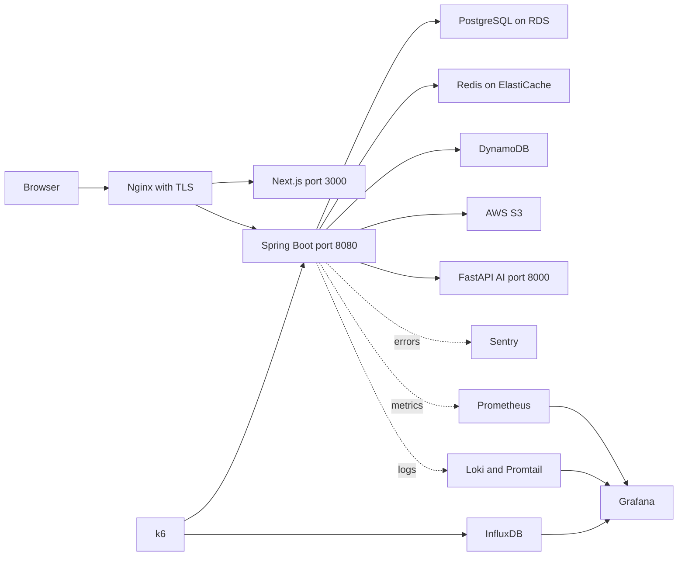
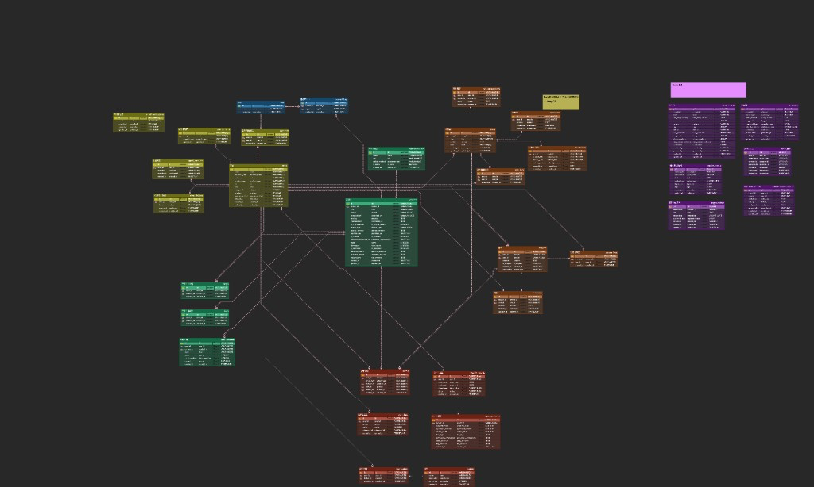
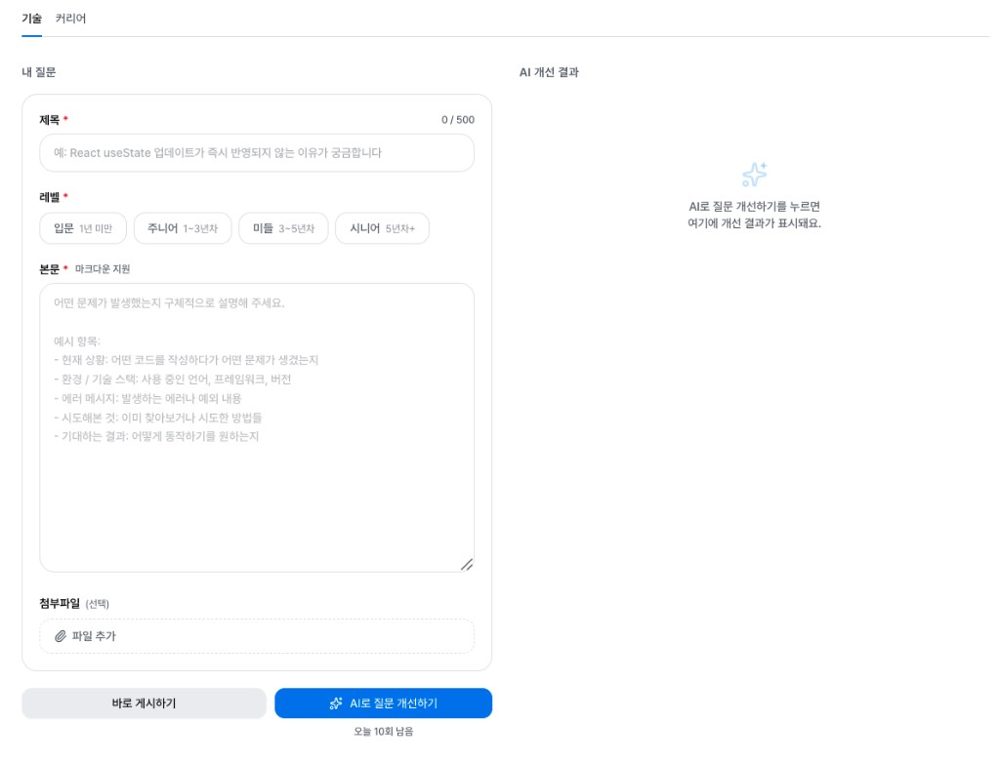
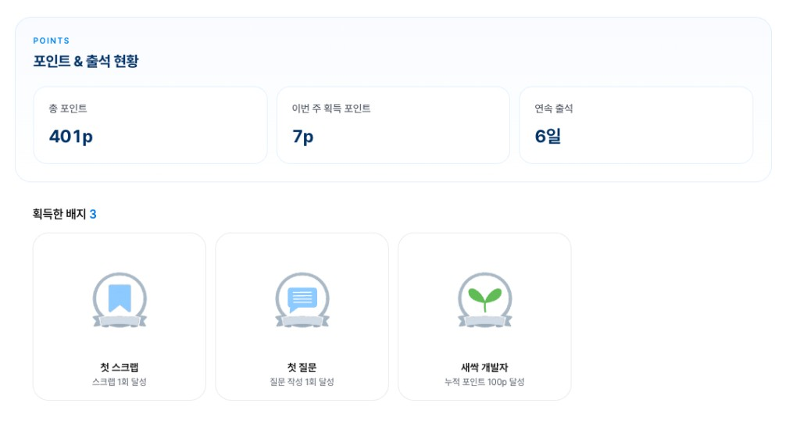
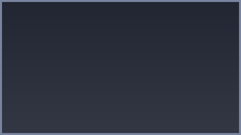
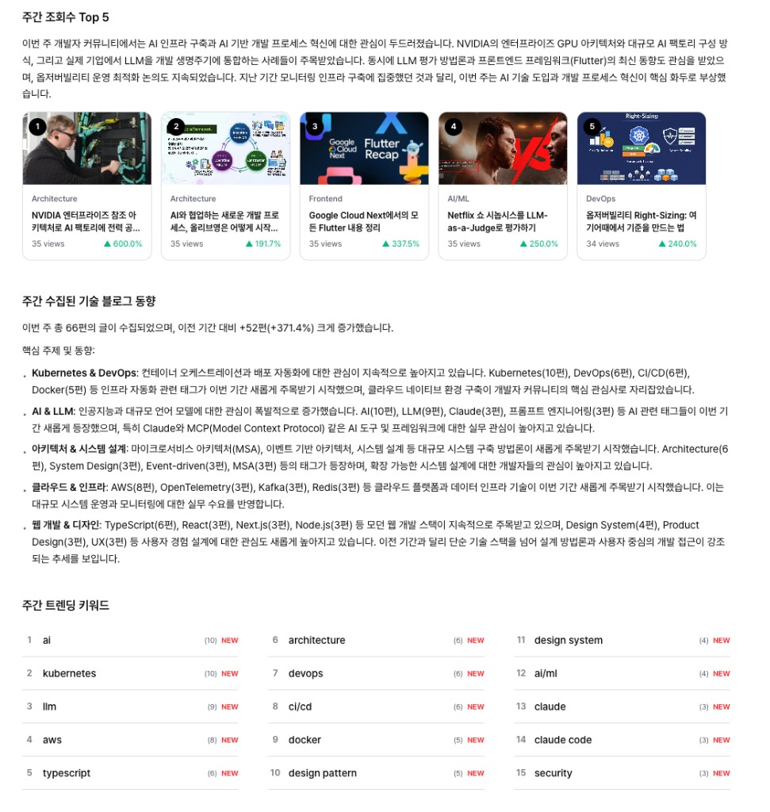
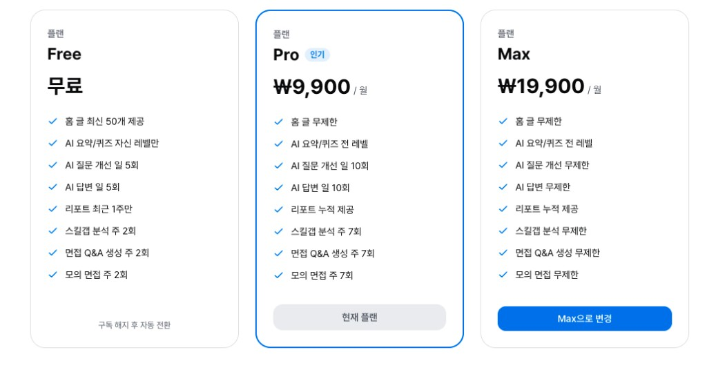
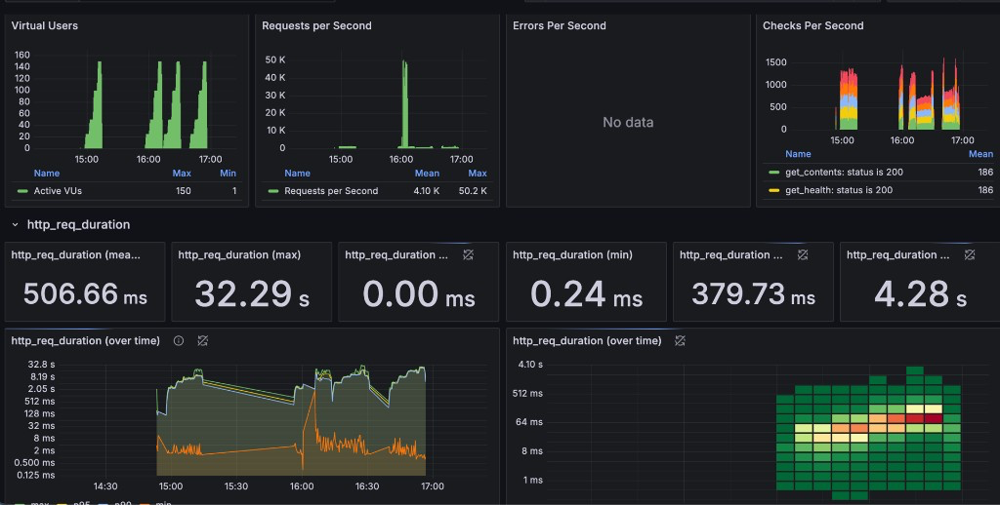
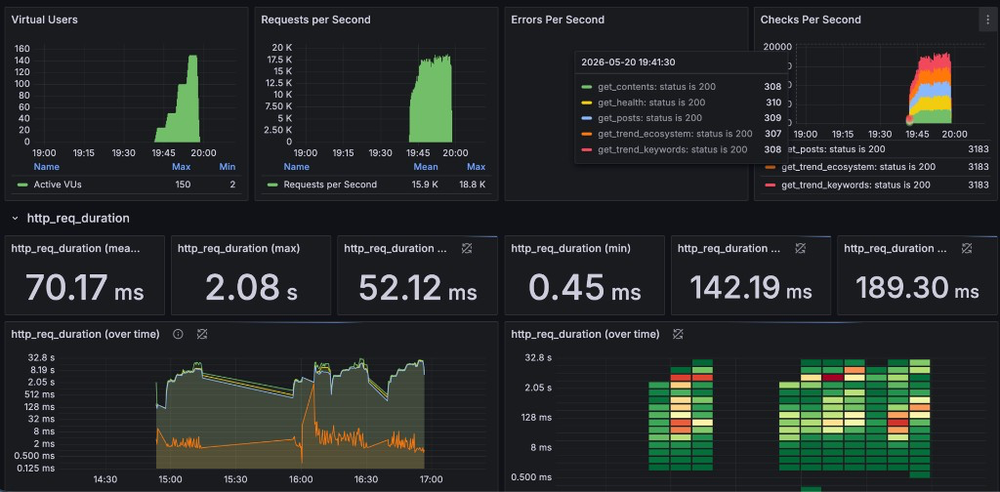

# devpick-backend

> Trace 개발자 성장 플랫폼의 Spring Boot API 서버입니다.
> 전체 프로젝트 소개는 [Devpick-Org](https://github.com/Devpick-Org) 에서 확인할 수 있습니다.

---

## 기술 스택


| 구분 | 기술 |
|------|------|
| 언어 | Java 21 |
| 프레임워크 | Spring Boot 3.5.11 |
| 빌드 | Gradle |
| API 서버 | Spring MVC, Validation, WebFlux WebClient |
| 인증과 보안 | Spring Security, JWT 0.12.6, GitHub Google OAuth2 |
| 데이터 접근 | Spring Data JPA, Hibernate, QueryDSL 5.1.0 |
| 관계형 DB | PostgreSQL 16 on AWS RDS |
| 캐시 | Redis 7 on AWS ElastiCache |
| 비정형 저장 | DynamoDB Enhanced Client |
| 파일 저장 | AWS S3 |
| 이메일 | Spring Mail |
| API 문서 | Springdoc OpenAPI 2.8.6, Swagger UI |
| 외부 연동 | FastAPI AI 서버, 토스페이먼츠 빌링키, GitHub OAuth, Google OAuth, 알라딘 API |
| 콘텐츠 처리 | jsoup 1.18.3, PDFBox 3.0.4, Apache POI 5.4.1 |
| 모니터링 | Spring Actuator, Micrometer Prometheus, Sentry 8.42.0 |
| 로그와 부하 테스트 | Loki, Promtail, InfluxDB, k6 |
| 테스트와 품질 | JUnit 5, Mockito, Spring Security Test, JaCoCo, SonarCloud |
| 배포 | Docker, Docker Compose, Nginx, GitHub Actions, AWS EC2 |

---

## 시스템 구조



```
브라우저
  └─ Nginx, TLS
       ├─ Next.js 프론트엔드 port 3000
       └─ Spring Boot API 서버 port 8080
              ├─ PostgreSQL on AWS RDS port 5432
              ├─ Redis on AWS ElastiCache port 6379
              ├─ DynamoDB on AWS
              ├─ AWS S3 파일 저장소
              ├─ FastAPI AI 서버 port 8000
              ├─ Sentry 에러 추적과 트레이싱
              └─ Prometheus, Grafana, Loki, Promtail 모니터링

k6 부하 테스트
  └─ Spring Boot API 호출
       └─ InfluxDB 저장
            └─ Grafana k6 대시보드
```

---

## 프로젝트 구조

```
devpick-backend
├── src/main/java/com/devpick
│   ├── domain
│   │   ├── user         # 회원가입, 로그인, 소셜인증, 프로필
│   │   ├── content      # 콘텐츠 피드, 스크랩, AI 요약, AI 퀴즈, 맞춤 추천
│   │   ├── community    # 게시글, 답변, AI 질문 개선, AI 답변, 첨부파일
│   │   ├── report       # 주간 리포트, 학습 히스토리
│   │   ├── point        # 포인트 적립, 배지
│   │   ├── job          # 채용 공고, 북마크, 모의면접
│   │   ├── resume       # 이력서 관리, 문서 파싱
│   │   ├── subscription # 구독 플랜, 토스페이먼츠 결제
│   │   └── trend        # 키워드 트렌드, 에코시스템 트렌드
│   └── global
│       ├── common       # 예외 처리, 공통 응답
│       ├── config       # Security, CORS, Swagger, S3, DynamoDB, Async, Jackson, WebClient
│       ├── controller   # 헬스 체크
│       ├── entity       # 공통 Base 엔티티
│       ├── security     # JWT 필터, 토큰 프로바이더
│       ├── storage      # 파일 스토리지
│       └── util         # 유틸리티
├── loadtest
│   └── k6               # smoke, load, stress 부하 테스트 시나리오
├── monitoring           # Prometheus, Grafana, Loki, Promtail, InfluxDB
├── docs                 # 설계 문서, ERD, 성능 개선 스크린샷
│   └── erd              # PostgreSQL ERD 이미지
└── scripts              # 운영 보정 SQL과 배포 후 정리 스크립트
```

---

## ERD

PostgreSQL 기준 Trace 백엔드 전체 엔티티 관계도입니다.



DDL과 테이블 정의는 [docs/erdcloud-postgres.sql](docs/erdcloud-postgres.sql), [docs/table-definition.md](docs/table-definition.md) 에서 확인할 수 있습니다.

---

## 주요 기능

<table>
  <tr>
    <td align="center" width="33%">
      
      <br />
      <strong>인증과 프로필</strong>
      <br />
      <sub>이메일 회원가입, GitHub Google OAuth2, JWT 갱신, 프로필 조회와 수정</sub>
    </td>
    <td align="center" width="33%">
      
      <br />
      <strong>콘텐츠와 AI 학습</strong>
      <br />
      <sub>개인화 피드, 스크랩, 레벨별 AI 요약, AI 퀴즈, 맞춤 추천</sub>
    </td>
    <td align="center" width="33%">
      
      <br />
      <strong>커뮤니티</strong>
      <br />
      <sub>질문 게시글, 답변 채택, 댓글, 첨부파일, 유사 질문, AI 답변</sub>
    </td>
  </tr>
  <tr>
    <td align="center" width="33%">
      
      <br />
      <strong>리포트와 포인트</strong>
      <br />
      <sub>주간 학습 리포트, 학습 히스토리, 포인트 적립, 배지 시스템</sub>
    </td>
    <td align="center" width="33%">
      
      <br />
      <strong>채용 매칭과 모의면접</strong>
      <br />
      <sub>채용 공고 수집과 매칭, 북마크, 면접 Q&A, 모의면접, 부족 역량 추천</sub>
    </td>
    <td align="center" width="33%">
      
      <br />
      <strong>이력서 관리</strong>
      <br />
      <sub>PDF와 DOCX 텍스트 추출, 마스터 이력서 저장, AI 기반 보강</sub>
    </td>
  </tr>
  <tr>
    <td align="center" width="33%">
      
      <br />
      <strong>트렌드 분석</strong>
      <br />
      <sub>부트캠프, 개발행사, 개발동아리, 트렌딩 키워드, 주간 상위 콘텐츠</sub>
    </td>
    <td align="center" width="33%">
      
      <br />
      <strong>구독과 결제</strong>
      <br />
      <sub>Free, Pro, Max 플랜, 토스페이먼츠 빌링키, 해지와 환불, 기능 횟수 제한</sub>
    </td>
    <td align="center" width="33%">
      
      <br />
      <strong>모니터링과 부하 테스트</strong>
      <br />
      <sub>Sentry, Prometheus, Grafana, Loki, k6로 에러와 성능 병목 추적</sub>
    </td>
  </tr>
</table>

---

## Getting Started

### 사전 요구사항

- Java 21
- Docker, Docker Compose
- `.env` 파일, `.env.example` 참고

### 로컬 실행, PostgreSQL과 Redis와 앱

```bash
git clone https://github.com/Devpick-Org/devpick-backend.git
cd devpick-backend
cp .env.example .env
docker compose -f docker-compose.yml -f docker-compose.local.yml up -d --build
```

### DB와 캐시만 실행, 앱은 IDE에서 직접

```bash
docker compose -f docker-compose.yml -f docker-compose.local.yml up -d postgres redis
./gradlew bootRun
```

### 빌드와 테스트

```bash
./gradlew build --no-daemon
./gradlew test --no-daemon
./gradlew jacocoTestReport
```

---

## API 문서

로컬 실행 후 `http://localhost:8080/swagger-ui/index.html` 에서 확인할 수 있습니다.

---

## 성능 개선, k6 부하 테스트

운영 환경에서 k6로 공개 GET API에 부하를 걸고, Grafana와 Prometheus로 병목을 본 뒤, 캐시와 쿼리, 트렌드 read path를 튜닝했습니다. 그 결과 전체 p95는 약 7초에서 189ms로, RPS는 약 42에서 1,000 이상으로 개선했습니다.

### 단계 1, 부하 테스트로 문제 발견

k6 `stress.js` 로 25, 50, 100, 150 VU 단계 부하를 걸었습니다. 요청이 에러로 죽지는 않았지만, 응답 시간이 초 단위로 늘어났고 DB 커넥션 풀이 꽉 차면서 요청이 대기하는 상태가 확인됐습니다.

| 지표 | 측정값 | 해석 |
|------|--------|------|
| 실패율 | 0퍼센트 | HTTP 요청이 에러로 죽지는 않음 |
| RPS | 약 42.6 | 초당 처리 요청 수가 낮은 상태 |
| p95 | 약 7.2초 | 요청 100개 중 95개가 7.2초 안에 끝남 |
| p99 | 약 10초 | 가장 느린 1퍼센트는 10초 근처까지 지연 |
| HikariCP max | 10 | DB 커넥션 풀 최대 크기 |
| HikariCP active max | 10 | DB 연결 10개가 모두 사용 중 |
| HikariCP pending max | 82 | 커넥션을 기다리는 요청이 최대 82개까지 증가 |

한 줄로 보면 CPU만의 문제가 아니라 DB 연결 10개가 모두 사용 중인 상태에서 요청이 줄을 섰고, 그 결과 API 응답이 7초 이상으로 느려졌습니다.

### 단계 2, API 별 병목 확인

k6 요청에 API 별 태그를 붙여 측정하고, Prometheus 백엔드 메트릭과 함께 확인했습니다. 평균보다 p95와 p99 같은 느린 꼬리 지표가 실제 사용자 체감에 더 가까웠습니다.

| API | 확인된 문제 |
|-----|-------------|
| `/trends/ecosystem` | 평균 5초대, p99 8초 수준 |
| `/posts` | p99 10.77초, max 19.93초 |
| `/contents` | p99 10.82초, max 20.25초 |
| `/trends/keywords` | 수십 ms 수준으로 상대적으로 빠름 |
| `/health` | 수십 ms 수준으로 상대적으로 빠름 |

튜닝 대상은 `/posts`, `/contents`, `/trends/ecosystem` 세 API로 좁혔습니다.

### 단계 3, 코드와 캐시, DB 튜닝



`/posts` 는 N plus 1 조회를 줄이고 공개 목록 응답에 Redis 캐시 TTL 30초를 적용했습니다. 글 목록 조회 뒤 유저와 답글을 반복 조회하던 흐름을 batch 조회 중심으로 바꿔 DB 왕복을 줄였습니다.

`/contents` 는 Redis와 DynamoDB 단건 조회를 batch 처리로 바꾸고, likes와 scraps 여부도 bulk 체크로 묶었습니다. 비로그인 공개 피드는 Redis에 30초 동안 캐싱했습니다.

`/trends/ecosystem` 은 캐시가 비어 있을 때 사용자 요청 스레드가 외부 수집을 기다리지 않도록 백그라운드 refresh로 전환했습니다. 이후 Redis JSON 역직렬화와 정렬 비용이 병목으로 드러나 EC2 메모리 snapshot 캐시를 추가했습니다.

| 항목 | 튜닝 전 | 1차 튜닝 후 | 해석 |
|------|---------|-------------|------|
| `/posts` p95 | 9.58초 | 1.20초 | N plus 1 제거와 Redis 캐시로 개선 |
| `/contents` p95 | 6.29초 | 1.19초 | batch 조회와 bulk 체크로 개선 |
| HikariCP pending | 82 | 24 | DB 커넥션 대기가 줄어듦 |
| `/trends/ecosystem` p95 | 7.60초 | 23.05초 | Redis JSON 역직렬화와 정렬 비용으로 악화 |

1차 튜닝으로 posts와 contents는 개선됐지만 ecosystem은 오히려 느려졌습니다. 그래서 트렌드 응답 경로를 Redis read 이후 매번 정렬하는 구조에서, 메모리 snapshot을 재사용하는 구조로 추가 개선했습니다.

### 단계 4, 최종 재측정과 전후 비교



같은 `stress.js` 시나리오와 같은 150 VU 조건으로 다시 측정했습니다. 실패율은 0퍼센트를 유지했고, 전체 p95와 API 별 p95가 모두 ms 단위로 내려갔습니다.

| 지표 | Before | After | 개선 |
|------|--------|-------|------|
| 전체 p95 | 약 7.3초 | **189ms** | 약 97퍼센트 감소 |
| RPS | 약 42.6 | **약 1,076** | 처리량 25배 이상 증가 |
| `/posts` p95 | 9.58초 | **261ms** | 초 단위 지연 제거 |
| `/contents` p95 | 6.29초 | **244ms** | 초 단위 지연 제거 |
| `/trends/ecosystem` p95 | 7.60초 | **143ms** | 트렌드 read path 안정화 |
| mean | 506ms | **70ms** | 평균 응답 시간 감소 |
| max | 32.29초 | **2.08초** | 최악 요청 지연 감소 |
| HikariCP pending | 82 | **24** | DB 커넥션 대기 완화 |

결론적으로 부하 테스트로 DB 커넥션과 N plus 1 병목을 확인했고, 쿼리와 Redis 캐시, 메모리 snapshot 최적화로 p95를 7초대에서 0.2초 미만으로 낮췄습니다.

> 부하 테스트 실행 방법과 시나리오 상세는 [`loadtest/README.md`](loadtest/README.md) 에서 확인할 수 있습니다.

---

## CI/CD

| Job | 트리거 | 설명 |
|-----|--------|------|
| Build & Test | PR to developV2 | Gradle 빌드와 JUnit 테스트 |
| SonarCloud | PR to developV2 | 커버리지와 코드 품질 분석, non-blocking |
| Auto Merge | `auto/` 브랜치 PR | CI 통과 시 developV2 자동 squash 머지 |
| Deploy | push to developV2 | EC2 SSH 자동 배포 |
| Backend CD | 수동 트리거 | GHCR Docker 이미지 빌드 |

---

## 브랜치 전략

| 브랜치 | 용도 |
|--------|------|
| `main` | 배포용 |
| `develop` | MVP |
| `developV2` | MVP 이후 통합 브랜치 |
| `feature/DP-{번호}-{기능명}` | 기능 개발 |
| `fix/DP-{번호}-{설명}` | 버그 수정 |
| `auto/feature/DP-{번호}-{기능명}` | 기능 개발, CI 통과 시 자동 머지 |
| `auto/fix/DP-{번호}-{설명}` | 버그 수정, CI 통과 시 자동 머지 |

---

## 팀

<table>
  <tr>
    <td align="center" width="180">
      <a href="https://github.com/khg9859">
        
      </a>
      <br />
      <strong>김홍근</strong>
      <br />
      <sub>PM, Backend Lead</sub>
      <br />
      <a href="https://github.com/khg9859">@khg9859</a>
    </td>
    <td align="center" width="180">
      <a href="https://github.com/nYeonG4001">
        
      </a>
      <br />
      <strong>박하영</strong>
      <br />
      <sub>Backend</sub>
      <br />
      <a href="https://github.com/nYeonG4001">@nYeonG4001</a>
    </td>
  </tr>
</table>
